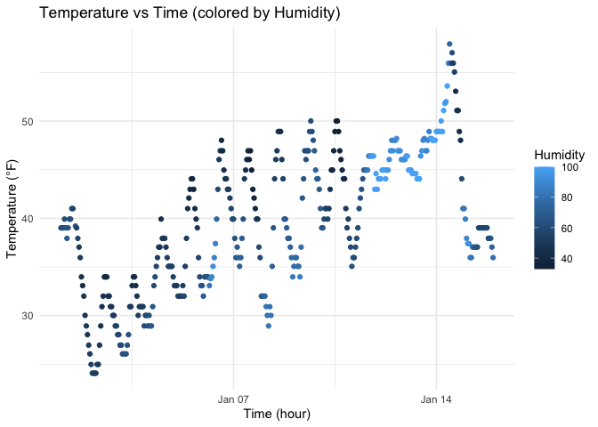

p8105_hw1_xf2302
================
2025-09-19

# Problem 1

# Add initial setup chunk and load required libraries

``` r
library(moderndive)
library(ggplot2)
```

# Load the dataset

``` r
data("early_january_weather")
```

# Add dataset summary description using inline R

Within the `early_january_weather` dataset, there are 358 rows and 15
columns. Key variables include *temperature* (measured in °F),
*humidity* (percentage of air moisture), and *time_hour* (timestamp for
each observation). The mean recorded temperature is about 39.58 degrees
Fahrenheit.

# Add scatterplot of temperature vs time_hour colored by humidity

``` r
library(tidyverse)
```

    ## ── Attaching core tidyverse packages ──────────────────────── tidyverse 2.0.0 ──
    ## ✔ dplyr     1.1.4     ✔ readr     2.1.5
    ## ✔ forcats   1.0.0     ✔ stringr   1.5.1
    ## ✔ lubridate 1.9.4     ✔ tibble    3.3.0
    ## ✔ purrr     1.1.0     ✔ tidyr     1.3.1
    ## ── Conflicts ────────────────────────────────────────── tidyverse_conflicts() ──
    ## ✖ dplyr::filter() masks stats::filter()
    ## ✖ dplyr::lag()    masks stats::lag()
    ## ℹ Use the conflicted package (<http://conflicted.r-lib.org/>) to force all conflicts to become errors

``` r
ggplot(early_january_weather, aes(x = time_hour, y = temp, color = humid)) +
  geom_point() +
  labs(
    title = "Temperature vs Time (colored by Humidity)",
    x = "Time (hour)",
    y = "Temperature (°F)",
    color = "Humidity"
  ) +
  theme_minimal()
```

<!-- -->
